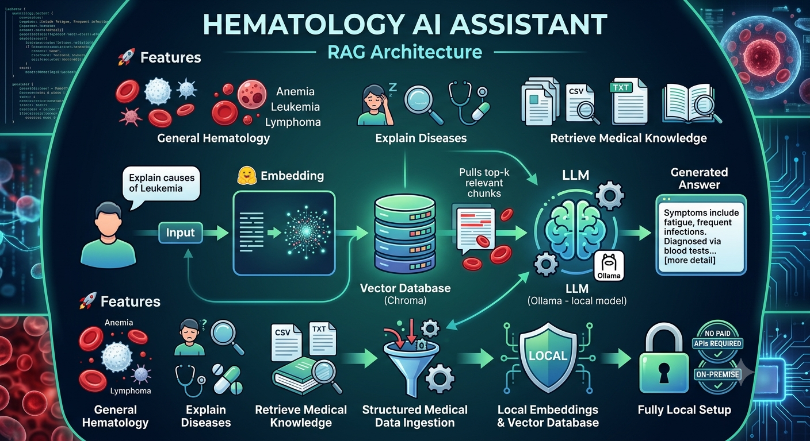

# 🩸 Hematology Chat Bot



A local AI assistant for hematology knowledge built with a Retrieval-Augmented Generation (RAG) workflow.
This repository creates a local, semantic-search-based chatbot using hematology notes and QA datasets.

---

## 🔍 What this project does

* Reads medical data from `data/hematology_notes.txt`, `data/hematology_qa.csv`, and `data/training_set.csv`
* Creates embeddings for clinical and educational hematology content
* Stores embeddings in a local Chroma vector database in `vector_db/`
* Uses semantic search to find relevant passages for each question
* Generates answers using a local LLM pipeline

---

## 📁 Key files

* `app.py` - Application entry point for the chatbot (if enabled)
* `ingest.py` - Ingests medical datasets and builds the vector store
* `query.py` - Runs the question-answering flow
* `rag.py` - Defines the retrieval and generation logic
* `data/` - Source medical text and QA files
* `vector_db/` - Local Chroma database storage
* `hem.png` - Project image included in this README

---

## ✅ Getting started

### 1. Create a Python environment

```powershell
python -m venv .venv
.\.venv\Scripts\activate
```

### 2. Install dependencies

```powershell
pip install -r requirements.txt
```

If there is no `requirements.txt`, install the expected packages manually:

```powershell
pip install langchain chromadb sentence-transformers
```

### 3. Ingest the data

```powershell
python ingest.py
```

This builds the local vector database in `vector_db/`.

### 4. Ask questions

```powershell
python query.py
```

---

## 🧠 How it works

1. `ingest.py` loads data from the `data/` folder.
2. Text is split, embedded, and stored in Chroma.
3. `query.py` embeds the user prompt.
4. The vector store returns the most relevant chunks.
5. The local LLM generates the final answer.

---

## 💬 Example questions

* What is anemia?
* What are the symptoms of leukemia?
* How is lymphoma diagnosed?
* What causes iron deficiency anemia?

---

## 📌 Notes

* `vector_db/` contains the local Chroma SQLite database.
* `data/` includes the source training files for ingestion.
* `hem.png` is included for branding and is displayed in this README.

---

## ⚠️ Disclaimer

This project is for educational and research use only. It is not medical advice.

---

## 🛠️ Project structure

```text
.
├── app.py
├── ingest.py
├── query.py
├── rag.py
├── README.md
├── hem.png
├── data/
│   ├── hematology_notes.txt
│   ├── hematology_qa.csv
│   └── training_set.csv
└── vector_db/
```

---

## 📚 Next steps

* Add `requirements.txt` if missing
* Extend `app.py` with a web or chat UI
* Add more hematology datasets
* Improve prompt engineering for more accurate answers

---

## 👩‍💻 Author

**Amina Jebari**
Engineering Student – AI & Data
